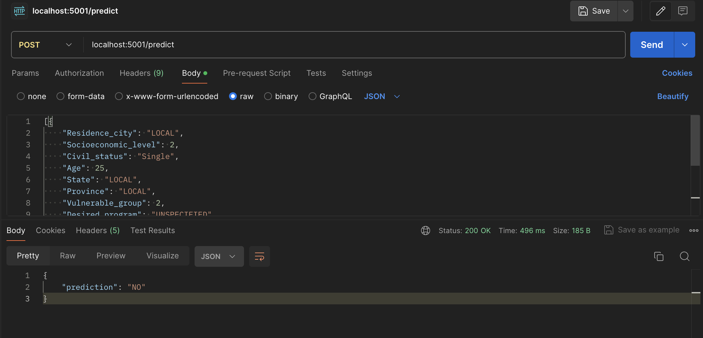

# Student Dropout Prediction

Predicting student dropout ("YES" or "NO") based on different factors like grades, family income, etc.



## Sklearn Pipeline
```python
def train():
    # Open processed data
    df = pd.read_csv('data/processed/current_data.csv')
    print(df.head())

    # Drop unnecessary columns
    df.drop('Unnamed: 0_x', axis=1, inplace=True)
    df.drop('Unnamed: 0_y', axis=1, inplace=True)

    # Save random row (for testing the prediction api)
    random_row = df.sample()
    random_row.to_json('src/serve/random_row.json', orient='records')
    print("Random row:\n", random_row)
    df = df.drop(random_row.index)

    # Define features and target
    X = df[['Socioeconomic_level', 'Age', 'Vulnerable_group', 'Family_income', 'STEM_subjects', 
            'H_subjects', 'AVG_subject', 'Residence_city', 'Civil_status', 'State', 'Province',
            'Desired_program', 'Father_level', 'Mother_level']]
    y = df['Dropout']

    # Split data
    X_train, X_test, y_train, y_test = train_test_split(X, y, test_size=0.2, random_state=42)

    # Define preprocessor and classifier
    numeric_features = ['Socioeconomic_level', 'Age', 'Vulnerable_group', 'Family_income', 'STEM_subjects',
                        'H_subjects', 'AVG_subject']
    categorical_features = ['Residence_city', 'Civil_status', 'State', 'Province', 'Desired_program',
                            'Father_level', 'Mother_level']

    # Fill missing values and scale numeric features
    numeric_transformer = Pipeline(steps=[
        ('imputer', SimpleImputer(strategy='mean')),
        ('scaler', MinMaxScaler())
    ])

    # Fill missing values and one-hot encode categorical features
    categorical_transformer = Pipeline(steps=[
        ('imputer', SimpleImputer(strategy='most_frequent')),
        ('onehot', OneHotEncoder(handle_unknown='ignore'))
    ])

    preprocessor = ColumnTransformer(
        transformers=[
            ('num', numeric_transformer, numeric_features),
            ('cat', categorical_transformer, categorical_features)
        ]
    )

    classifier = MLPClassifier(max_iter=1000, random_state=1234)

    pipeline = Pipeline(steps=[
        ('preprocessor', preprocessor),
        ('classifier', classifier)
    ])

    # Train model
    pipeline.fit(X_train, y_train)
    
    # Save model
    joblib.dump(pipeline, 'models/model.joblib')

    # Evaluate model
    predictions = pipeline.predict(X_test)
    print("Predictions:\n", predictions)

    report = classification_report(y_test, predictions)
    print("Classification Report:\n", report)
```

## Setup Poetry 
Install Poetry
```console
pip install poetry
```

Initialize Poetry
```console
poetry init
```

Install required dependencies with Poetry
```console
poetry add dvc
poetry add pandas
poetry add scikit-learn
poetry add flask
poetry add evidently
poetry add openpyxl
```

## Setup DVC ("Data Version Control")
Add data to .gitignore (because we added it to DVC)

Add data folder to DVC
```console
dvc init
dvc add data
dvc push
```

Add data.dvc to GIT
```console
git add data.dvc
git push
```

## Process Data
```python
python src/data/process_data.py
```

## Validate and Test Data
```python
python src/validation/my_validation.py
```
```python
python src/validation/evidently_test.py
```

## Train and Evaluate Model
```python
python src/models/train_eval.py
```

## Start Prediction API
```python
python src/serve/api.py
```

#### Test API:
```json
[{
    "Residence_city": "LOCAL",
    "Socioeconomic_level": 2,
    "Civil_status": "Single",
    "Age": 25,
    "State": "LOCAL",
    "Province": "LOCAL",
    "Vulnerable_group": 2,
    "Desired_program": "UNSPECIFIED",
    "Family_income": 1500000,
    "Father_level": "PRIMARY SCHOOL",
    "Mother_level": "UNDERGRADUATE",
    "Dropout": "NO",
    "STEM_subjects": 50.8,
    "H_subjects": 56.4,
    "AVG_subject": 53.6
}]
```

API response example:
```json
{
    "prediction": "NO"
}
```
